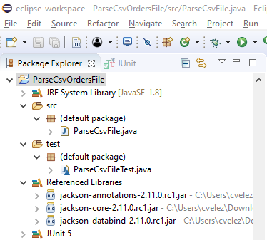
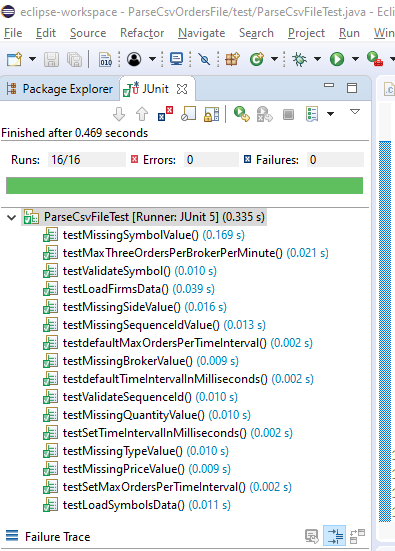

# ParseCsvOrdersFile
This is a java program that reads a trades/orders file and filters the orders based on a few rules:
   1 only orders with values for the fields of broker, symbol, type, quantity, sequence id, side, price should be accepted.
   2 only orders for symbols traded on the exchange should be accepted.
   3 each broker may only submit three orders per minute, any additional orders should be rejected.
   4 within a single broker’s trades, ids must be unique. Repeated ids for the same broker should be rejected. 

The program outputs two files with the lists of broker and sequence id of accepted and rejected orders, in the order in which the orders were sent:
     OrdersAccepted.csv,
     OrdersRejected.csv
     
Additionally, the program generates two more files in json format with lists of accepted and rejected orders, in the order in which the  orders were sent:
     OrdersAccepted.json,
     OrdersRejected.json
     
### High level design overview		
The program loads the symbols, and firms files into their corresponding sets, to be used for later trades validation.
It uses a map of String to Set, to keep track of unique order ids per broker. 
To take care of the three orders per minute requirement for each broker, the program uses a map of String to Integer.
As oppose to reading the entire orders file into memory and then processing it, this program reads the orders file sequentially and dynamically process/parses the records and writes them to their corresponding files (accepted and rejected files in csv and json formats).

### Setup required before running the program.
Copy to HOME directory: 
    trades.csv,
    symbols.txt,
    firms.txt 

### How to run the program
The program can be downloaded and run from inside eclipse or in a standalone fashion at any java compatible system. 

### From command prompt
Open a command prompt and cd into your project folder. This folder should contain a java source file and three Jackson library jar files:
     ParseCsvFile.java,
     jackson-core-2.11.0.rc1.jar,
     jackson-databind-2.11.0.rc1.jar,
     jackson-annotations-2.11.0.rc1.jar

Commands:

// to compile

javac -classpath *; ParseCsvFile.java

// to run

java -classpath *; ParseCsvFile 

Note: “*;” in the commands above instruct the compiler to look for all available libraries in the same directory as the source file
      For Linux/Unix, “;” should be replaced with “:”

### Output after successful compilation and running:

READ/PROCESS CSV FILE - STARTED:
  Loading symbols file : HOME_DIRECTORY/symbols.txt
  Loading firms file : HOME_DIRECTORY/firms.txt
  Reading from : HOME_DIRECTORY/trades.csv
  Parsing order records to : HOME_DIRECTORY/OrdersAccepted.csv
  Parsing order records to : HOME_DIRECTORY/OrdersRejected.csv
  Parsing order records to : HOME_DIRECTORY/OrdersAccepted.json
  Parsing order records to : HOME_DIRECTORY/OrdersRejected.json
READ/PROCESS CSV FILE - COMPLETED:

After parsing/reading trades.csv from the HOME directory, the following generated files will be written to the same HOME directory:
     OrdersAccepted.csv
     OrdersAccepted.json
     OrdersRejected.csv
     OrdersRejected.json
     
### From Eclipse
Download project and run it within eclipse:
The project in eclipse should have the following structure/dependencies:

Notice the three Jackson library dependencies and Junit

Copy to HOME directory the following files: 
    trades.csv,
    symbols.txt,
    firms.txt

After parsing/reading trades.csv from the HOME directory, the following generated files will be written to the same HOME directory:
    OrdersAccepted.csv,
    OrdersAccepted.json,
    OrdersRejected.csv,
    OrdersRejected.json
    
### How to run JUnit Test Cases in Eclipse

After downloading the project and setting it up in Eclipse, Copy the cvsFiles folder (with files) to HOME directory.
The files in the csvFiles folder are needed for the Junit test cases. 

### Test cases Information
I have implemented 16 JUnit test cases (in file ParseCsvFileTest.java) to be run in Eclipse. These test cases require the trade scenario files included in the csvTestFile directory.

The following are the JUnit test cases created for testing of the application:

  void testLoadSymbolsData(), 	
  void testLoadFirmsData(),
	void testMissingBrokerValue(),
	void testMissingSymbolValue(), 
  void testMissingTypeValue(), 
  void testMissingQuantityValue(),	
  void testMissingSequenceIdValue(),
  void testMissingSideValue(),	
  void testMissingPriceValue(),
  void testValidateSymbol()   -- validate only orders for symbols traded on the exchange,
  void testMaxThreeOrdersPerBrokerPerMinute()	-- validate only three orders per minute allowed per broker,	
	void testValidateSequenceId() -- validate uniqueness of sequence id of orders per broker,	 			
	void testSetMaxOrdersPerTimeInterval(), 
	void testSetTimeIntervalInMilliseconds(), 
	void testdefaultMaxOrdersPerTimeInterval(),	
	void testdefaultTimeIntervalInMilliseconds() 
	 

